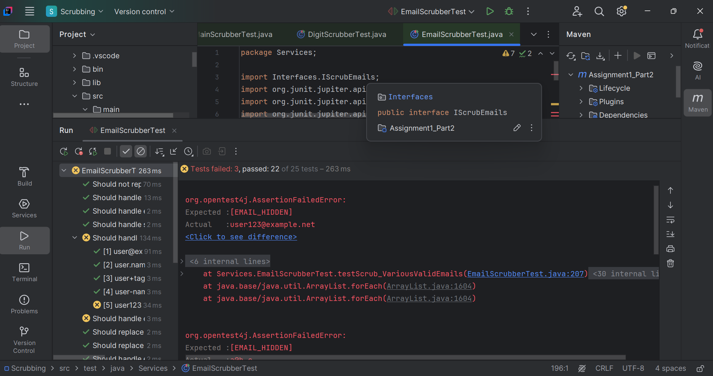
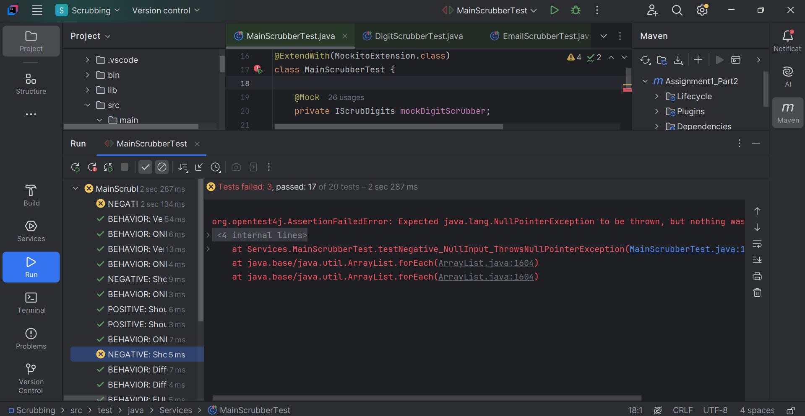

# Scrubbing System Test – Software Testing Project

A software testing project for a Scrubbing System application, focused on validating system functionality using manual and automated testing techniques.

## Project Overview
This project includes:
- Functional testing
- System testing
- Test case design
- Bug reporting
- Automated testing implementation

The goal of the project is to ensure the reliability, correctness, and performance of the Scrubbing System through structured testing methodologies.

## Technologies & Tools
- Java
- JUnit
- Selenium
- Maven

## screenshots
### DigitScrubber


### EmailScrubber


### MainScrubber


## Project Structure
```text
src/        -> Source code
Tests/      -> Test cases and testing files
pom.xml     -> Maven dependencies and configuration


